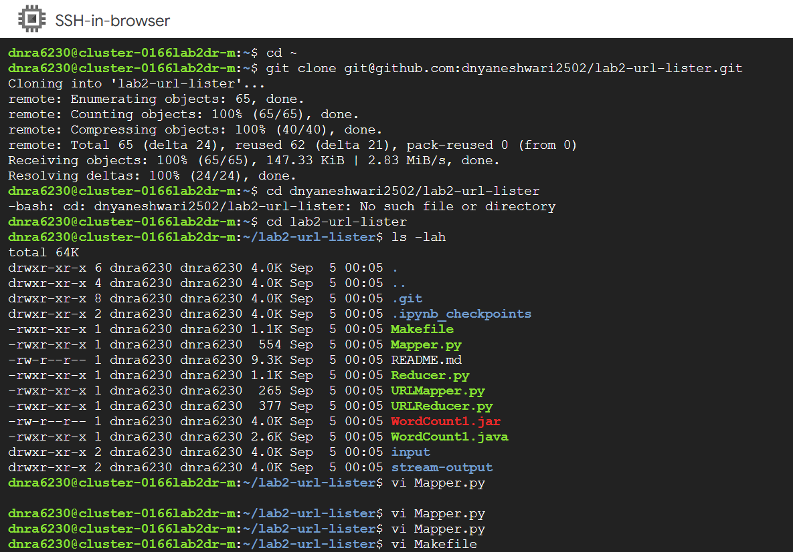
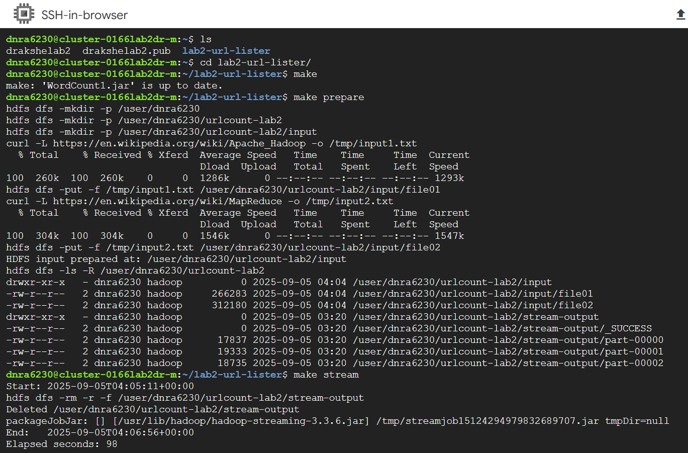
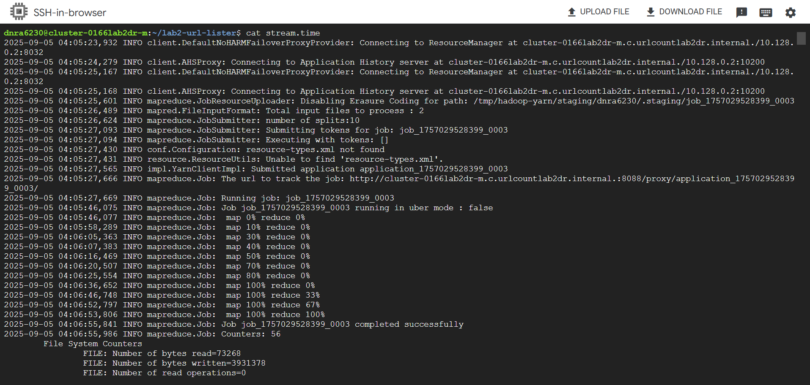
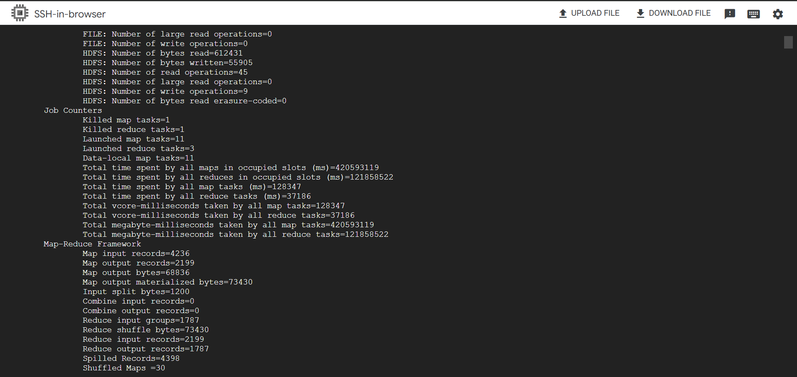
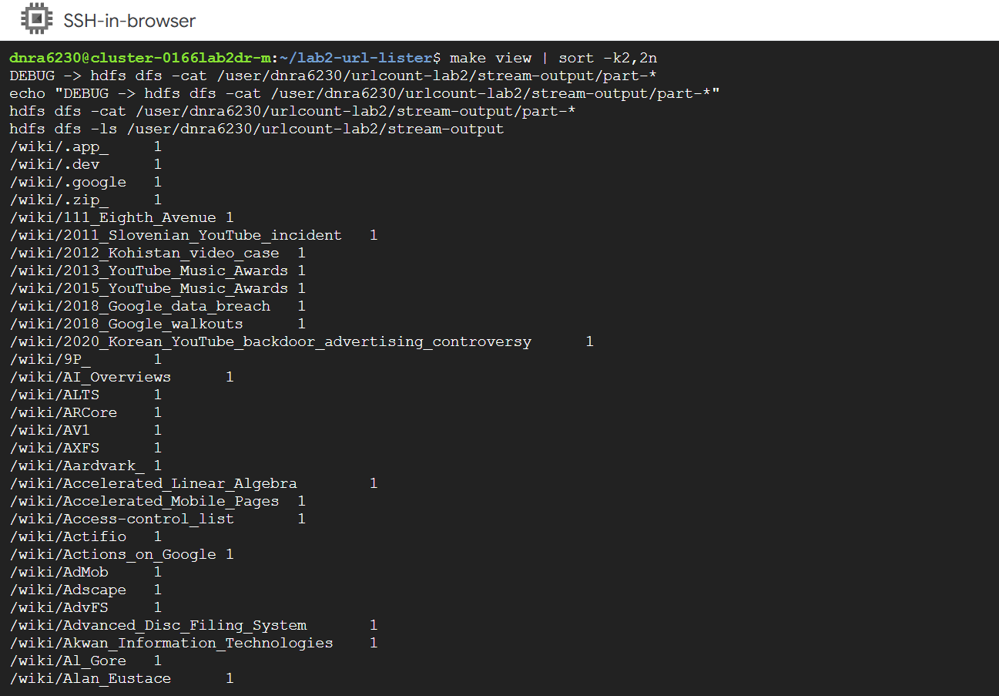
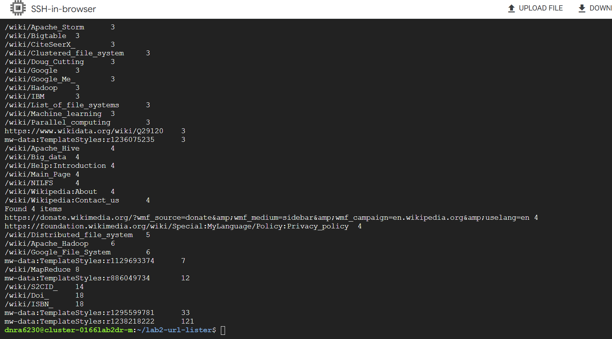
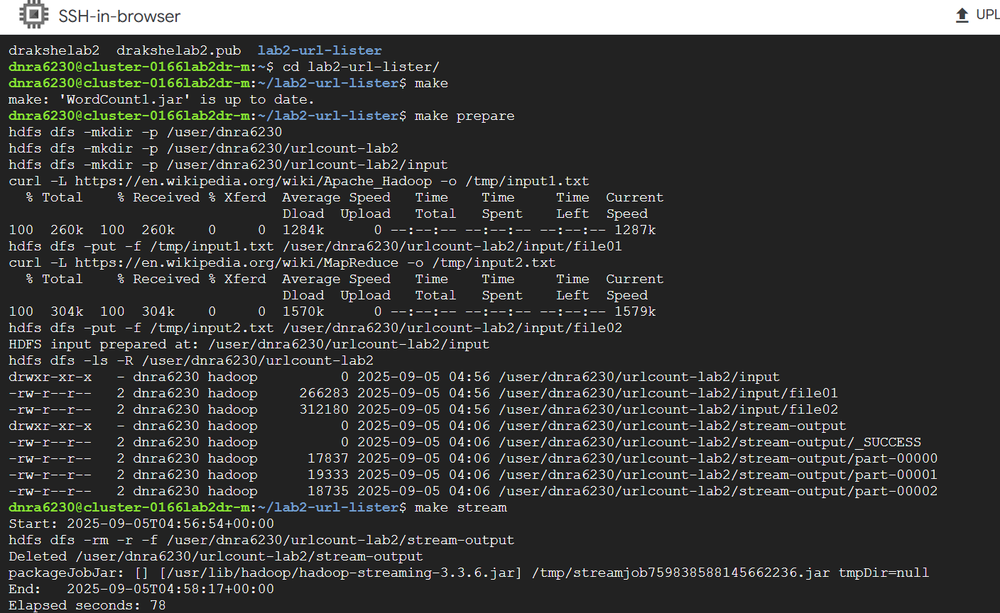
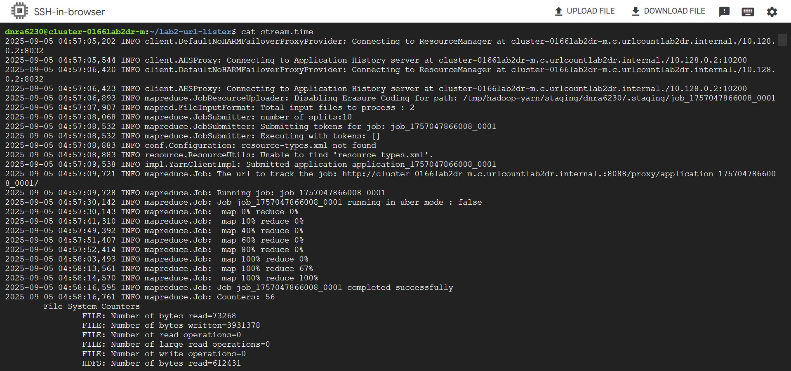
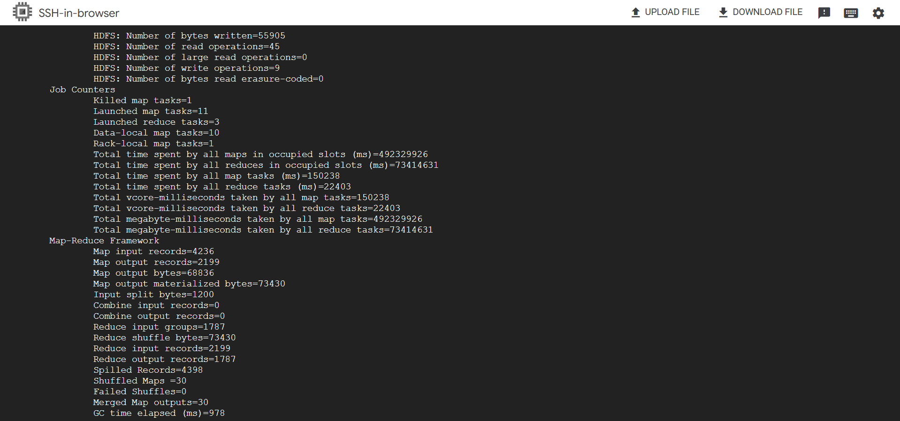
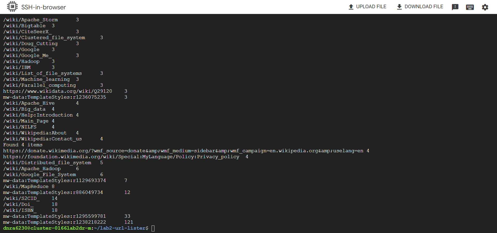

In this assignment, I modified the standard Mapper WordCount code file to a URLCount code. This updated code snippet counts the URLs from Wikipedia articles instead of counting words. I updated and created two new files called URLMapper.py and URLReducer.py as Mapper and Reducer respectively. 

I cloned the repository using csel and developed the URLMapper.py file by adding the code regular expression which finds URL-like values in the Wikipedia pages. Additionally, I changed the path in Makefile that points to the URLMapper.py and URLReducer.py files. Then on the csel terminal I followed a series of commands that builds the file (make), uploads the inputs (make prepare), combines mapper and reducer with Hadoop streaming (make stream), and then prints the outputs (make view). After receiving the results, I committed and pushed the changes to GitHub repository.

After successfully executing the code in csel environment, I deployed the same code using Google Cloud Dataproc. I enabled the Dataproc API and created the cluster. This part of assignment required SSH key generation for connecting to the GitHub and cloning the repository. 

So basically, I first created Cluster with 1 Master and 2 Worker nodes. After creating the cluster, I generated the SSH key and cloned my GitHub repository for further operations into the master node. Then I prepared HDFS input by downloading the Wikipedia pages, uploaded them to HDFS and then executed the Hadoop Streaming Job using URLMapper.py and URLReducer.py files. After the job was executed successfully, the results were stored in stream-output folder. And then at last, I used “make view” command to view the output on the SSH terminal. Please refer to the output screenshots below:

I changed the cluster configuration to 1 Master and 4 Worker nodes and then implemented the same steps again. Please refer to the outputs for the same below:

After scaling the worker nodes from 2 workers to 4 workers, I observed that the execution time for 2 nodes (98.27s) is greater than the execution time for 4 nodes (77.15s). This tells us that adding more workers reduced the runtime by approximately 21 seconds. I also observed that the CPU time spent (2 nodes- 17910ms, 4 nodes- 16750ms) and the Memory usage for 4 nodes configuration is slightly less than for the 2 nodes configuration. This basically helped me understand that if we add more worker nodes, it will help in improving performance through parallel processing.

Author: Dnyaneshwari Rakshe
